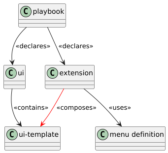

[](https://github.com/kiwigrid/antora-menu-extension/releases)
[](https://www.npmjs.com/package/@kiwigrid/antora-main-menu)
[](https://www.npmjs.com/package/@kiwigrid/antora-main-menu)

# antora-menu-extension
Antora 3 extension to assemble customized main menu

The extension allows [Antora](https://antora.org/) to build a customizable main menu structure composing handlebar templates provided by the UI resources.



The used UI templates are configurable at the extension to allow theming and styling within the UI resources as usual.

## Usage

Make sure the handlebar templates are available within your UI resources specified in the playbook 
```shell
npm i @kiwigrid/antora-main-menu
```

```yaml
...
ui:
  bundle:
    url: ..../ui-bundle.zip
```

```
ui-bundle.zip
    \-- partials
        |-- ....
        |-- your templates.hbs
        \-- ....
```

Link the menu template within the menu bar handlebar template (usually `header-content.hbs`).

```handlebars
....
{{> main-menu}}
....
```

Then add the extension to your playbook:

```yaml
antora:
  extensions:
    - require: "@kiwigrid/antora-main-menu"
      menu: <menu structure definition>
      hbs: <UI template customization>
```

### Menu Structure
The menu structure may be defined inline within the extension configuration or as dedicated resource within any antora component referenced within the playbook.

1. dedicated resource
```yaml
antora:
  extensions:
    - require: "@kiwigrid/antora-main-menu"
      component: <component reference>
      file: <resource within component>
```
2. inline definition
```yaml
antora:
  extensions:
    - require: "@kiwigrid/antora-main-menu"
      menu: <definition>
```

The definition and the dedicated component resource are following the same schema:

A menu definition consists a list if of menu groups.

A **group** is defined as:

```yaml
- title: <group display text>
  entries: 
      - <nested element 1>
      - ...
      - <nested element n>
```
Nested elements may be groups (again), component references and/or external links.

A **component reference** is defined as:

```yaml
- module: <moduleId>
```

An **external link** is defined as:

```yaml
- title: <link display tex>
  link: <target url>
```

Example menu
```yaml
antora:
  extensions:
    - require: "@kiwigrid/antora-main-menu"
      menu:
        - title: Products
          entries:
            - module: product-A
            - title: Product Sub 1
              entries:
                - module: product-B
        - title: Help
          entries:
            - title: Antora Documentation
              link: https://docs.antora.org
            - title: Configure this extension
              link: https://github.com/kiwigrid/antora-menu-extension
```

### UI Template Customization

The extension creates a handlebar template based on the given playbook parameter and adds the template into the UI catalog for site rendering.

The created template itself is composed on templates provided by the UI resource you are referring in the playbook.

```yaml
ui:
  bundle:
    url: ..../ui-bundle.zip
```

The template itself are used to apply the menu rendering and theming.

The extension expects the following templates:

- Main template: 
  - the template name to create and add into the template catalog
- Group beginning template:
  - the template to begin a list of menu entries
- Group end template:
  - the template to close a list of menu entries
- Document reference template
  - A link to a site internal or external url.

The template names may be customized via extension config.

```yaml
antora:
  extensions:
    - require: "@kiwigrid/antora-main-menu"
      hbs: 
        menu: <Main template>                         # default main-menu
        group_start: <Group beginning template>       # default main-menu-group-start
        group_end: <Group end template>               # default main-menu-group-end
        document_ref: <Document reference template>   # default main-menu-docref
```
The templates are supporting the following parameter:

* main-menu: No parameter
* main-menu-group-end: No parameter


#### main-menu-group-start

* `level`
  * Nesting level of the menu group to begin. (`0` == main menu, `1...n` nesting level)
* `group_title`
  * Menu group text


#### main-menu-group-end

No parameter

#### main-menu-docref

* `resolved`
  * Exposing, if the module of the menu specification item could be resolved through the playbooks included module sources.
  * The `doc_title` contains in that case the `name` value from the modules antora.yml field.
* `external`
  * Exposing, if the `ref` links to a site external target URL 
* `doc_title`
  * Menu entry text, if the `ref` could be resolved, or the name of the module that couldn't be resolved. 
* `ref`
  * Resolvable (either absolute or relative to playbook base) document URI.
  * The parameter contains `#`, if the parameter `resolved` is marked `false`.

### Sample

Given the extension config uses the standard templates and inline menu definition:

```yaml
antora:
  extensions:
    - require: "@kiwigrid/antora-main-menu"
      menu:
        - title: Products
          entries:
            - title: sub group
              entries:
                - module: existing-module
                - module: not-existing-module
                - title: Antora Doc
                  link: https://docs.antora.org
```

The template `main-menu` is created by the extension as:

```handlebars
{{> main-menu-group-start level=0 group_title="Products"}}
    {{> main-menu-group-start level=1 group_title="sub group"}}
        {{> main-menu-docref resolved=true external=false ref="/existing-module/latest/<startpage of existing-module>.html" doc_title="<Title of existing-module>"}}
        {{> main-menu-docref resolved=false external=false ref="#" doc_title="not-existing-module"}}
        {{> main-menu-docref resolved=true external=true ref="https://docs.antora.org" doc_title="Antora Doc"}}
    {{> main-menu-group-end}}
{{> main-menu-group-end}}
```

Find sample templates in [templates](doc/templates) folder.


